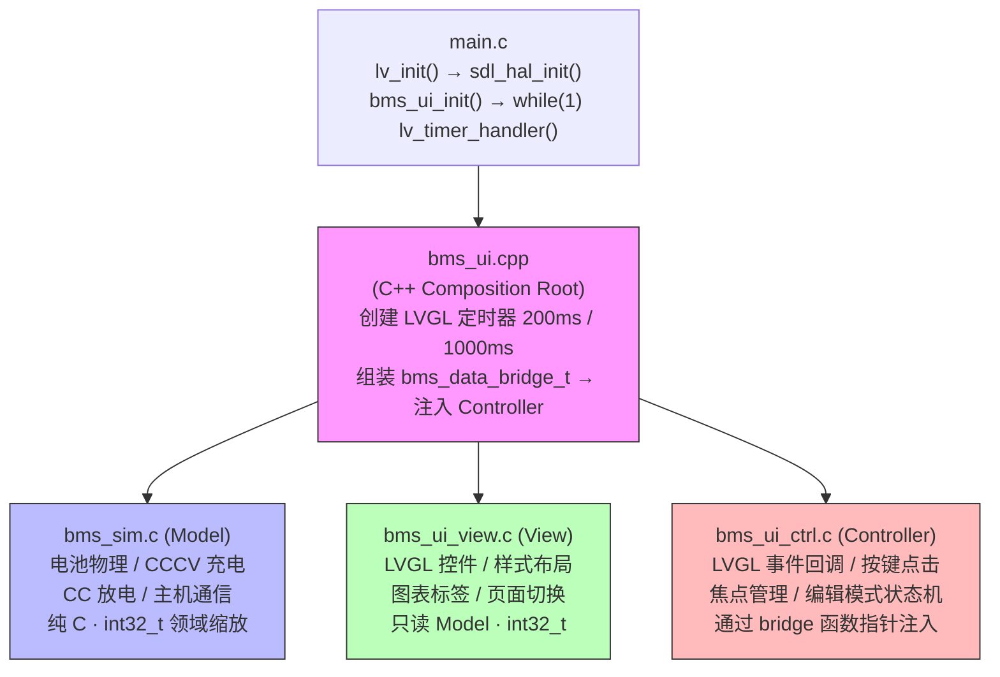

# BMS UI 模拟器

基于 [LVGL](https://github.com/lvgl/lvgl) 的电池管理系统（BMS）UI 模拟器。在 PC（SDL2）上运行完整的 BMS 界面，支持 STM32 嵌入式移植。

## 架构

采用 Model-View-Controller 模式，View/Controller 为纯 C + LVGL 代码，可直接移植到嵌入式平台。



- **Model**（`src/sim/`）— 电池物理模拟，零 LVGL 依赖，`bms_state_t` 使用 `int32_t` 领域缩放整数（mV、mA、x10）
- **View**（`src/view/`）— LVGL 控件创建、样式、数据刷新，分为 view/pages/styles/refresh 四个子模块
- **Controller**（`src/controller/`）— LVGL 事件回调、焦点管理，通过 `bms_data_bridge_t` 函数指针访问 Model
- **Composition Root**（`src/bms_ui.cpp`）— 唯一的 C++ 文件，组装依赖注入，创建 LVGL 定时器

## 项目结构

```
src/
├── main.c                    # 平台入口（PC SDL2 主循环）
├── bms_state.h               # 共享数据结构（bms_state_t）
├── bms_ui.h                  # 公共接口（extern "C"）
├── bms_ui.cpp                # C++ 组合根
├── hal/                      # 平台 HAL（SDL2 显示/输入）
├── sim/                      # Model：电池物理模拟
├── view/                     # View：LVGL 控件、样式、刷新
│   ├── bms_ui_view.c         #   初始化、页面切换、widget getter
│   ├── bms_ui_pages.c        #   4 个页面创建函数
│   ├── bms_ui_styles.c       #   颜色定义、style 对象
│   └── bms_ui_refresh.c      #   数据刷新、fmt_milli/fmt_x10 整数格式化
└── controller/               # Controller：事件回调、焦点管理
```

## 快速开始

### 安装依赖

```bash
# Debian/Ubuntu
sudo apt install build-essential cmake libsdl2-dev

# Arch
sudo pacman -S base-devel cmake sdl2
```

### 构建运行

```bash
cmake -B build
cmake --build build -j
./build/main
```

### FreeRTOS 模式

```bash
cmake -B build -DUSE_FREERTOS=ON
cmake --build build -j
```

FreeRTOS 模式需要在 `lv_conf.h` 中设置 `#define LV_USE_OS LV_OS_FREERTOS`，堆大小在 `config/FreeRTOSConfig.h` 中配置。

### VSCode 调试

1. 安装推荐插件
2. 打开 `simulator.code-workspace`
3. 选择 `Debug LVGL demo with gdb`，按 F5 启动

## LVGL 配置

关键配置项（`lv_conf.h`）：

| 配置项 | PC 值 | STM32 值 | 说明 |
|--------|-------|----------|------|
| `LV_COLOR_DEPTH` | 32 | 16 | SPI 屏用 RGB565 |
| `LV_MEM_SIZE` | 1MB | 8-128KB | 根据 SRAM 调整 |
| `LV_USE_SDL` | 1 | 0 | PC 用 SDL2 |
| `LV_USE_OS` | `LV_OS_NONE` | `LV_OS_FREERTOS` | 可选 |
| `LV_FONT_MONTSERRAT_*` | 全部 | 仅 12/14/28 | 节省 Flash |

## 文档

- [解耦方案](docs/decoupling_proposal.md) — MVC 架构设计与实施偏差说明
- [STM32 移植指南](docs/stm32_porting_guide.md) — HAL 接口、lv_conf 配置、移植检查清单
- [STM32F103 优化指南](docs/stm32f103_optimization.md) — Flash/SRAM 预算、字体精简、BMS-Core 集成

## 移植到 STM32

只需替换 `src/sim/bms_sim.c` 为硬件驱动（读取 INA226/DAC8562/NTC），View 和 Controller 层完全复用。详见 [STM32 移植指南](docs/stm32_porting_guide.md)。
