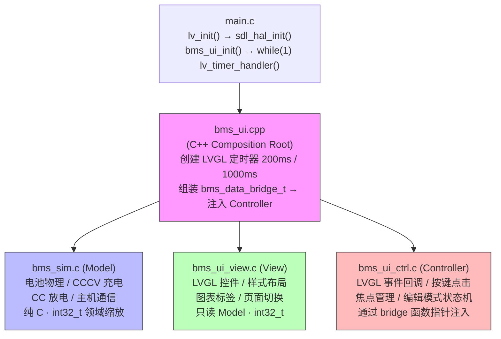
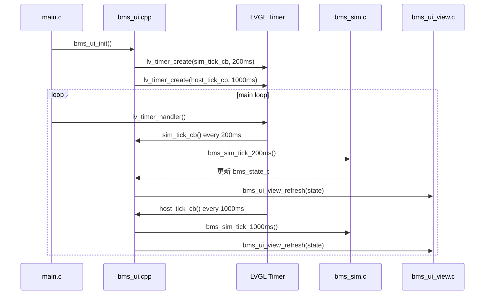
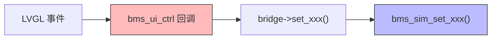

# BMS UI 解耦方案

## 1. 现状分析

### 1.1 当前架构

`bms_ui.c`（1621 行）是一个单体文件，包含以下三类逻辑：

| 层次 | 职责 | 行数（约） | 依赖 |
|------|------|-----------|------|
| 测试/模拟逻辑 | 电池物理模型、CCCV 充电、CC 放电、主机通信模拟 | ~300 行 | LVGL 定时器、`lv_tick_get()` |
| 渲染/UI 逻辑 | 控件创建、样式定义、页面布局、图表更新 | ~800 行 | LVGL 控件 API |
| 程序逻辑 | 事件回调、按键处理、焦点管理、页面切换 | ~500 行 | LVGL 事件系统 |

### 1.2 耦合点分析

**模拟 → UI（直接写入控件）：**
- `bms_sim_tick` 直接调用 `lv_label_set_text()` 更新 Page 0 标签
- `bms_sim_tick` 直接调用 `lv_chart_set_next_value()` 更新 Page 1/2 图表
- `bms_sim_tick` 直接修改 `footer_circle` 颜色/透明度
- `bms_sim_tick` 在自动停止时直接修改 toggle 按钮的标签和样式
- `host_comm_tick` 直接写入 `lbl_p4_terminal` 日志文本

**UI → 模拟（事件回调直接修改模拟变量）：**
- `widget_click_handler` 直接修改 `charge_active`、`discharge_active`
- `widget_key_handler` 直接修改 `target_u_set`、`target_i_set`、`target_i_dis`

**模拟读取 UI 状态：**
- `bms_sim_tick` 检查 `current_page` 决定更新哪些控件
- `bms_sim_tick` 检查 `btn_p2_toggle` 指针来更新按钮标签
- 事件回调检查 `charge_active`/`discharge_active` 来锁定焦点

**核心问题：** 模拟逻辑需要知道 LVGL 控件指针，UI 逻辑需要知道模拟变量，两者双向直接引用，无法独立编译或测试。

---

## 2. 目标架构：Model-View-Controller

### 2.1 分层概览



> **注：** View 层进一步拆分为 `bms_ui_view.c`（初始化/切换）、`bms_ui_pages.c`（页面创建）、`bms_ui_styles.c`（样式定义）、`bms_ui_refresh.c`（数据刷新）。Controller 通过 `bms_data_bridge_t` 函数指针结构体访问 Model，不直接依赖 `bms_sim`。

### 2.2 各层职责

**Model（`bms_sim.h/c`，位于 `src/sim/`）— 纯数据 + 计算，零 LVGL 依赖：**
- 电池物理状态（`soc_x10`、`voltage_mV`、`current_mA`、`temperature_x10`、`resistance_mOhm`，全部为 `int32_t` 领域缩放整数）
- 充放电设置（`charge_u_set_mV`、`charge_i_set_mA`、`discharge_i_set_mA`、使能标志）
- 系统设置（波特率、端口）
- 主机通信状态（在线状态、包计数、预测 SOC、日志行）
- 两个 tick 函数：`bms_sim_tick_200ms()` 和 `bms_sim_tick_1000ms()`
- 导出只读数据结构 `bms_state_t` 供 View 读取

**View（`src/view/` 下多个文件）— LVGL 控件，只读访问 Model：**
- `bms_ui_view.c`：初始化入口、页面切换逻辑、widget getter
- `bms_ui_pages.c`：4 个页面创建函数、chart/button 辅助函数
- `bms_ui_styles.c`：颜色定义、7 个 style 对象、初始化
- `bms_ui_refresh.c`：数据刷新、toggle 样式、`fmt_milli()`/`fmt_x10()` 整数格式化
- 共享 widget 指针通过 `bms_ui_widgets_t` 结构体管理（在 `bms_ui_internal.h` 中定义）
- 刷新函数 `bms_ui_view_refresh(const bms_state_t*)`，不直接修改任何 Model 变量

**Controller（`bms_ui_ctrl.h/c`，位于 `src/controller/`）— 事件处理，通过 bridge 连接 Model 和 View：**
- LVGL 事件回调（`on_click`、`on_key`、`on_global_key`、`on_button_focus`、`on_footer_focus`）
- 接收用户输入 → 通过 `bms_data_bridge_t` 函数指针调用 Model setter
- 管理焦点导航、编辑模式状态机
- 不直接依赖 `bms_sim`，通过依赖注入解耦

**Composition Root（`bms_ui.cpp`）— C++ 胶水层：**
- 初始化 Sim、View、Controller
- 组装 `bms_data_bridge_t`（将 `bms_sim_*` 函数指针填入 bridge）
- 创建 LVGL 定时器（200ms 物理 tick、1000ms 主机通信 tick）
- 唯一的 C++ 文件，使用 `extern "C"` 链接

---

## 3. 接口定义

### 3.1 Model 接口

```c
// bms_state.h — 共享数据结构（View 和 Controller 读取）
#ifndef BMS_STATE_H
#define BMS_STATE_H
#include <stdint.h>
#include <stdbool.h>

typedef struct {
    /* 电池物理状态 — 全部为 int32_t 领域缩放整数，对齐 INA226 API */
    int32_t  soc_x10;            /* SoC * 10 (85.0% = 850) */
    int32_t  voltage_mV;         /* 端电压 mV */
    int32_t  current_mA;         /* 电流 mA，放电为负 */
    int32_t  temperature_x10;    /* 温度 * 10 (25.0°C = 250) */
    int32_t  resistance_mOhm;    /* 内阻 mΩ */

    /* 充电设置 */
    int32_t  charge_u_set_mV;    /* 目标电压 mV */
    int32_t  charge_i_set_mA;    /* 目标电流 mA */
    bool     charge_active;

    /* 放电设置 */
    int32_t  discharge_i_set_mA; /* 目标电流 mA */
    bool     discharge_active;
    bool     low_volt_alert;

    /* 系统设置 */
    int      baud_rate_idx;      /* 0:9600, 1:115200 */
    int      port_idx;           /* 0:UART0, 1:UART1 */

    /* 主机通信 */
    uint8_t  predicted_soc;
    bool     host_online;
    uint32_t rx_packet_count;

    /* 状态标志 */
    bool     charge_auto_stopped;
    bool     discharge_auto_stopped;

    /* 日志行（最新在前，4 行） */
    char     log_lines[4][64];
} bms_state_t;

#endif
```

```c
// bms_sim.h — Model 公共接口
#ifndef BMS_SIM_H
#define BMS_SIM_H
#include "bms_state.h"

void bms_sim_init(void);
void bms_sim_tick_200ms(void);
void bms_sim_tick_1000ms(void);
const bms_state_t* bms_sim_get_state(void);

/* Controller 通过 bms_data_bridge_t 调用的 setter */
void bms_sim_set_charge_enable(bool enable);
void bms_sim_set_discharge_enable(bool enable);
void bms_sim_set_charge_u_mV(int32_t mV);
void bms_sim_set_charge_i_mA(int32_t mA);
void bms_sim_set_discharge_i_mA(int32_t mA);
void bms_sim_set_baud_rate(int idx);
void bms_sim_set_port(int idx);

#endif
```

### 3.2 View 接口

```c
// bms_ui.h — 公共接口（extern "C"，供 main.c 调用）
#ifndef BMS_UI_H
#define BMS_UI_H
#ifdef __cplusplus
extern "C" {
#endif
#include "lvgl/lvgl.h"

void bms_ui_init(void);
void bms_ui_update_soc(uint8_t soc_val);

#ifdef __cplusplus
}
#endif
#endif
```

> **注：** `bms_ui_init()` 内部创建 LVGL 定时器驱动 tick 和刷新，外部只需调用 `lv_timer_handler()`。View 内部接口在 `bms_ui_view.h` 中定义，包含 `bms_ui_view_refresh(const bms_state_t*)`、页面切换、widget getter 等函数。

### 3.3 Controller 接口

```c
// bms_ui_ctrl.h — Controller 公共接口（依赖注入模式）
#ifndef BMS_UI_CTRL_H
#define BMS_UI_CTRL_H
#include "bms_state.h"

/* 函数指针桥接结构体 — Controller 通过此结构体访问 Model，不直接依赖 bms_sim */
typedef struct {
    const bms_state_t* (*get_state)(void);
    void (*set_charge_enable)(bool);
    void (*set_discharge_enable)(bool);
    void (*set_charge_u_mV)(int32_t);
    void (*set_charge_i_mA)(int32_t);
    void (*set_discharge_i_mA)(int32_t);
    void (*set_baud_rate)(int);
    void (*set_port)(int);
} bms_data_bridge_t;

void bms_ui_ctrl_init(const bms_data_bridge_t* bridge);

#endif
```

> **注：** 页面管理由 View 层内部处理（`bms_ui_view_current_page()`、`bms_ui_view_switch_page()`），不对外暴露。

---

## 4. 数据流

### 4.1 Model → View（周期刷新）

实际实现中，tick 和刷新由 `bms_ui.cpp` 中的 LVGL 定时器驱动：



`bms_ui_view_refresh()` 内部：
```c
void bms_ui_view_refresh(const bms_state_t *s)
{
    // Page 0: SoC 显示
    if(current_page == 0) {
        update_soc_labels(s->soc_x10, s->voltage_mV, s->current_mA,
                          s->temperature_x10, s->resistance_mOhm);
    }
    // Page 1: CCCV 充电
    if(current_page == 1) {
        update_charge_chart(s->voltage_mV, s->current_mA);
        update_charge_readout(s->voltage_mV, s->current_mA);
        update_charge_button_state(s->charge_auto_stopped);
    }
    // ... Page 2, 3
    // Header/Footer
    update_header_soc(s->predicted_soc);
    update_footer_circle(s->charge_active, s->discharge_active);
}
```

### 4.2 Controller → Model（用户输入）

Controller 通过 `bms_data_bridge_t` 函数指针间接调用 Model setter，不直接依赖 `bms_sim`：



```c
// bms_ui_ctrl.c 中的回调示例
static const bms_data_bridge_t *s_bridge;  // 初始化时注入

static void on_charge_toggle_click(lv_event_t *e)
{
    const bms_state_t *s = s_bridge->get_state();
    s_bridge->set_charge_enable(!s->charge_active);
}
```

### 4.3 Controller → View（焦点/页面管理）

Controller 调用 View 层暴露的页面管理函数：
```c
// 通过 View 的 getter 获取 widget，绑定事件
lv_obj_t *btn = bms_ui_view_btn_charge_toggle();
lv_obj_add_event_cb(btn, on_charge_toggle_click, LV_EVENT_CLICKED, NULL);

// 页面切换通过 View 内部函数
bms_ui_view_switch_page(page_idx);  // 隐藏/显示页面容器，更新 header/footer 指示器
```

---

## 5. 迁移策略

### 5.1 分步迁移（推荐）

**第一步：提取 Model（最小侵入）**
- 将 `bms_ui.c` 中的模拟变量（`batt_soc`、`charge_active` 等）提取到 `bms_model.c`
- 将 `bms_sim_tick` 和 `host_comm_tick` 的计算逻辑移到 `bms_model_tick_*()`
- `bms_model.c` 导出 `bms_state_t` 只读结构
- `bms_ui.c` 中的 timer 回调改为读取 `bms_model_get_state()` 后更新控件
- **此时不改变事件回调**，它们仍然直接修改 Model 变量（通过 setter）

**第二步：提取 Controller**
- 将 `widget_click_handler`、`widget_key_handler`、`global_key_handler` 移到 `bms_input.c`
- 将 `footer_menu_focus_cb`、`button_focus_event_cb` 移到 `bms_input.c`
- Controller 通过 Model setter 修改状态，不再直接写模拟变量
- View 的 `bms_ui_refresh()` 从 Model 读取状态更新控件

**第三步：清理 View**
- `bms_ui.c` 仅保留控件创建、样式定义、`bms_ui_refresh()`
- 移除所有对模拟变量的直接引用
- 移除 timer 创建（移到 main loop 或 Controller）

### 5.2 迁移后的文件结构

```
src/
├── main.c                    # 平台入口（PC SDL2 主循环）
├── bms_state.h               # 共享数据结构（bms_state_t，int32_t 类型）
├── bms_ui.h                  # 公共接口（extern "C"）
├── bms_ui.cpp                # C++ 组合根：组装 bridge，创建 LVGL 定时器
├── hal/
│   ├── hal.h                 # 平台 HAL 接口
│   └── hal.c                 # SDL2 显示/输入初始化
├── sim/
│   ├── bms_sim.h             # Model 公共接口
│   └── bms_sim.c             # 电池物理、充放电、主机通信（PC 用 float 内部）
├── view/
│   ├── bms_ui_internal.h     # 共享 widget 指针结构体
│   ├── bms_ui_view.h         # View 公共接口
│   ├── bms_ui_view.c         # 初始化入口、页面切换、widget getter
│   ├── bms_ui_pages.h        # 页面创建 API
│   ├── bms_ui_pages.c        # 4 个页面创建函数
│   ├── bms_ui_styles.h       # 样式/颜色定义
│   ├── bms_ui_styles.c       # 样式初始化
│   └── bms_ui_refresh.c      # 数据刷新、整数格式化（fmt_milli/fmt_x10）
└── controller/
    ├── bms_ui_ctrl.h         # Controller 公共接口 + bms_data_bridge_t
    └── bms_ui_ctrl.c         # 事件回调、焦点管理
```

---

## 6. 权衡与风险

### 6.1 优势

- **可测试性**：`bms_sim.c` 可以独立编译和单元测试，不需要 LVGL
- **可移植性**：Model 层零 LVGL 依赖，可直接用于嵌入式固件
- **可维护性**：修改 UI 布局不影响物理模型，修改物理算法不影响 UI
- **复用性**：同一 Model 可驱动不同的 View（LCD、串口、上位机）

### 6.2 风险

- **实时性**：周期刷新模式可能引入 1-2 帧延迟（200ms tick + LVGL 渲染），对 BMS 应用可接受
- **代码量增加**：从 1 个文件变为 8 个 .c/.cpp 文件 + 7 个头文件，结构更清晰但代码总量增加约 20%
- **迁移工作量**：约 2-3 天工作量，需要仔细处理状态同步
- **过度工程**：如果项目规模不再增长，当前单文件结构也可接受

### 6.3 建议

- 如果项目会接入真实 BMS 硬件 → **强烈建议解耦**，Model 层可直接移植到嵌入式固件
- 如果仅作为 PC 模拟器演示 → 当前结构足够，解耦收益有限
- 推荐先执行第一步（提取 Model），验证可行性后再决定是否继续

---

## 7. 实施状态与偏差说明

> **本节记录实际实施（commit `5eb72c6` ~ `f586ac3`）与原始方案的偏差。**

### 7.1 已完成

MVC 解耦已全部完成，`bms_ui.c`（1621 行）已删除，拆分为独立模块。

### 7.2 命名偏差

| 原方案 | 实际实现 | 说明 |
|--------|---------|------|
| `bms_model.h/c` | `bms_sim.h/c` | Model 层命名为 Sim（模拟器），位于 `src/sim/` |
| `bms_input.h/c` | `bms_ui_ctrl.h/c` | Controller 层重命名，位于 `src/controller/` |
| `bms_ui.c`（View） | 4 个文件 | View 进一步拆分为 view/pages/styles/refresh |
| `bms_model_init()` | `bms_sim_init()` | 所有 Model API 前缀改为 `bms_sim_` |
| `bms_model_get_state()` | `bms_sim_get_state()` | |
| `bms_input_bind()` | `bms_ui_ctrl_init(bridge)` | 改为依赖注入模式 |

### 7.3 数据类型偏差

原方案使用 `float` 类型，实际实现全部改为 `int32_t` 领域缩放整数：

| 原方案 | 实际实现 | 缩放说明 |
|--------|---------|---------|
| `float soc` | `int32_t soc_x10` | SoC × 10（85.0% = 850） |
| `float voltage` | `int32_t voltage_mV` | 毫伏 |
| `float current` | `int32_t current_mA` | 毫安（负 = 放电） |
| `float temperature` | `int32_t temperature_x10` | 温度 × 10（25.0°C = 250） |
| `float r_internal` | `int32_t resistance_mOhm` | 毫欧 |
| `float charge_u_set` | `int32_t charge_u_set_mV` | 毫伏 |
| `float charge_i_set` | `int32_t charge_i_set_mA` | 毫安 |
| `float discharge_i_set` | `int32_t discharge_i_set_mA` | 毫安 |

**优势：** 领域缩放整数比 Q16.16 定点数更适合 BMS 应用——显示时无需格式化转换，精度自然（mV 是精确值），对齐 INA226 传感器 API。显示层使用 `fmt_milli()` 和 `fmt_x10()` 纯整数格式化函数，完全避免浮点运算。

### 7.4 架构偏差

| 原方案 | 实际实现 |
|--------|---------|
| Controller 直接调用 `bms_model_set_xxx()` | Controller 通过 `bms_data_bridge_t` 函数指针间接调用，支持依赖注入 |
| 无 C++ 代码 | `bms_ui.cpp` 作为 C++ 组合根，使用 `extern "C"` 链接 |
| 主循环手动调用 tick + refresh | LVGL 定时器自动驱动（200ms + 1000ms） |
| `bms_state_t` 仅含基本字段 | 新增 `log_lines[4][64]`、`baud_rate_idx`、`port_idx` 等字段 |
