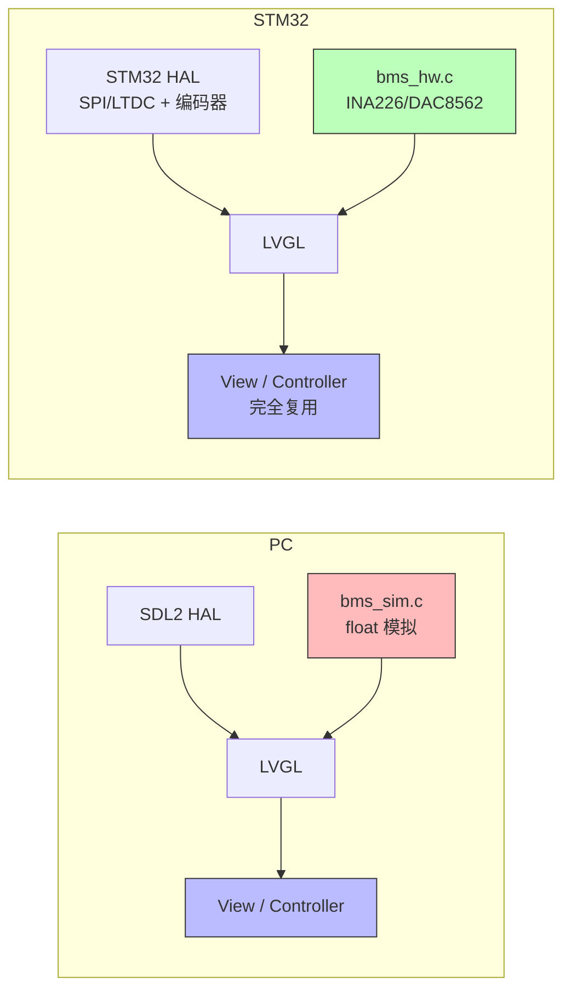
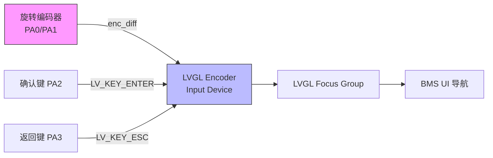

# BMS UI STM32 移植指南

## 1. 架构概览

当前项目基于 LVGL PC 模拟器（SDL2），运行在桌面环境。移植到 STM32 需要替换平台相关的 HAL 层和 `bms_sim.c`（模拟逻辑），而 View/Controller 层作为纯 LVGL 控件代码可直接复用。

### PC vs STM32 架构对比



### 文件变更矩阵

| 文件 | 操作 | 说明 |
|------|------|------|
| `src/hal/hal.c` | **替换** | SDL 显示/输入 → STM32 LTDC/SPI 显示 + 触摸/编码器输入 |
| `src/hal/hal.h` | **替换** | 移除 `sdl_hal_init`，定义 STM32 初始化接口 |
| `src/main.c` | **替换** | POSIX 主循环 → STM32 HAL/FreeRTOS 主函数 |
| `src/freertos/freertos_posix_port.c` | **删除** | 仅用于 PC 模拟，STM32 使用原生 FreeRTOS |
| `CMakeLists.txt` | **修改** | 移除 SDL2，添加 STM32 工具链和 BSP |
| `lv_conf.h` | **修改** | 见下方详细配置 |
| `config/FreeRTOSConfig.h` | **修改** | 堆大小 512MB → 64-256KB |
| `src/bms_ui.cpp` | 不变 | C++ 组合根，LVGL 定时器配置 |
| `src/bms_ui.h` | 不变 | 公共接口（`extern "C"`） |
| `src/bms_state.h` | 不变 | 共享数据结构（`int32_t` 类型） |
| `src/sim/bms_sim.c` | **替换** | PC 模拟逻辑替换为真实硬件驱动（见下方说明） |
| `src/sim/bms_sim.h` | 不变 | Model 接口定义 |
| `src/view/*.c` | 不变 | LVGL 控件管理、页面创建、样式、数据刷新 |
| `src/controller/bms_ui_ctrl.c` | 不变 | 事件回调/焦点管理 |

> **关键：** 只有 `bms_sim.c` 需要替换为硬件驱动。View 和 Controller 层是纯 LVGL 代码，完全可移植。STM32 上用 `bms_hw.c` 实现 `bms_sim.h` 接口，读取 INA226/DAC8562/NTC 替代模拟变量。

---

## 2. HAL 接口定义

### 2.1 显示接口

```c
// src/hal/hal.h -- STM32 版本
#pragma once
#include "lvgl.h"

// 屏幕分辨率
#define SCREEN_W  240
#define SCREEN_H  135

/**
 * @brief 初始化 STM32 显示和输入设备
 * @return LVGL display 对象指针
 */
lv_display_t * stm32_hal_init(void);
```

```c
// src/hal/hal.c -- STM32 版本框架
#include "hal.h"
#include "lvgl.h"

// 显示缓冲区（DMA 可访问内存，如 AXI SRAM 或 DTCM）
// 部分缓冲模式：每行 240 像素 * 20 行 = 4800 像素
#define BUF_LINES  20
static lv_color_t buf1[SCREEN_W * BUF_LINES];
static lv_color_t buf2[SCREEN_W * BUF_LINES];  // 双缓冲（可选）

static void flush_cb(lv_display_t *disp, const lv_area_t *area, uint8_t *px_map);
static void read_cb(lv_indev_t *indev, lv_indev_data_t *data);

lv_display_t * stm32_hal_init(void)
{
    // 1. 创建 LVGL group
    lv_group_set_default(lv_group_create());

    // 2. 初始化显示
    lv_display_t *disp = lv_display_create(SCREEN_W, SCREEN_H);
    lv_display_set_flush_cb(disp, flush_cb);
    lv_display_set_buffers(disp, buf1, buf2, sizeof(buf1), LV_DISPLAY_RENDER_MODE_PARTIAL);

    // 3. 初始化输入设备（编码器，匹配 BMS UI 的 LEFT/RIGHT/ENTER/ESC 导航）
    lv_indev_t *indev = lv_indev_create();
    lv_indev_set_type(indev, LV_INDEV_TYPE_ENCODER);
    lv_indev_set_read_cb(indev, read_cb);
    lv_indev_set_group(indev, lv_group_get_default());

    return disp;
}

// 显示刷新回调 -- 通过 SPI/DMA/LTDC 将像素数据写入物理屏幕
static void flush_cb(lv_display_t *disp, const lv_area_t *area, uint8_t *px_map)
{
    // 方案 A: SPI 显示（ST7789/ILI9341）
    // lcd_set_window(area->x1, area->y1, area->x2, area->y2);
    // lcd_write_pixels_dma((uint16_t *)px_map, (area->x2 - area->x1 + 1) * (area->y2 - area->y1 + 1));

    // 方案 B: LTDC（STM32F4/F7/H7 + RGB 屏）
    // 直接写入帧缓冲地址，LTDC 硬件自动扫描输出

    lv_display_flush_ready(disp);  // 必须在 DMA 完成后调用（可在 DMA 中断中）
}

// 输入读取回调 -- 读取 GPIO 编码器或触摸屏状态
static void read_cb(lv_indev_t *indev, lv_indev_data_t *data)
{
    // 编码器方案：
    // data->enc_diff = encoder_get_diff();   // 旋转量（-1/0/+1）
    // data->key = encoder_get_pressed_key(); // LV_KEY_ENTER / LV_KEY_ESC / 0
    // data->state = (data->key != 0) ? LV_INDEV_STATE_PRESSED : LV_INDEV_STATE_RELEASED;

    // 触摸屏方案（如果用触摸替代编码器）：
    // data->point.x = touch_x;
    // data->point.y = touch_y;
    // data->state = touch_pressed ? LV_INDEV_STATE_PRESSED : LV_INDEV_STATE_RELEASED;
}
```

### 2.2 输入设备映射

BMS UI 使用编码器风格导航，STM32 输入方案：



| PC 模拟键 | LVGL Key | STM32 硬件方案 |

| PC 模拟键 | LVGL Key | STM32 硬件方案 |
|-----------|----------|----------------|
| 方向键 LEFT/RIGHT | `LV_KEY_LEFT`/`LV_KEY_RIGHT` | 编码器旋转 / GPIO 左右键 |
| Enter | `LV_KEY_ENTER` | 编码器按下 / GPIO 确认键 |
| ESC | `LV_KEY_ESC` | GPIO 返回键 |
| Space | `' '` | GPIO 翻页键（可选） |

### 2.3 Tick 源

LVGL 需要一个周期性 tick 来驱动动画和定时器。

```c
// 方案 A: 定时器中断（推荐，不依赖 RTOS）
// 例如 TIM6，1ms 中断周期
void TIM6_DAC_IRQHandler(void) {
    HAL_TIM_IRQHandler(&htim6);
    lv_tick_inc(1);  // 每 1ms 调用一次
}

// 方案 B: FreeRTOS tick hook
void vApplicationTickHook(void) {
    lv_tick_inc(1);
}
```

### 2.4 主循环

```c
// src/main.c -- STM32 版本
#include "hal.h"
#include "bms_ui.h"

int main(void)
{
    HAL_Init();
    SystemClock_Config();  // STM32 时钟配置（目标芯片特定）
    MX_GPIO_Init();
    MX_SPI1_Init();        // 或 MX_LTDC_Init()
    MX_TIM6_Init();        // tick 定时器
    MX_FREERTOS_Init();    // 如果使用 FreeRTOS

    lv_init();
    stm32_hal_init();
    bms_ui_init();         // 内部创建 LVGL 定时器（200ms/1000ms）驱动 tick 和刷新

    while (1) {
        uint32_t delay = lv_timer_handler();
        HAL_Delay(delay);  // 或 vTaskDelay(pdMS_TO_TICKS(delay))
    }
}
```

---

## 3. lv_conf.h 配置变更

### 3.1 必须修改

```c
// 色深：32-bit → 16-bit（SPI 屏通常为 RGB565）
#define LV_COLOR_DEPTH  16

// 内存：1MB → 根据目标芯片调整
#define LV_MEM_SIZE     (64 * 1024)   // 64KB，STM32F4
// #define LV_MEM_SIZE  (128 * 1024)  // 128KB，STM32H7

// 禁用 SDL 驱动
#define LV_USE_SDL      0

// 禁用 PC 示例和演示（节省 Flash）
#define LV_BUILD_EXAMPLES  0
#define LV_BUILD_DEMOS     0

// OS 选择（如果使用 FreeRTOS）
#define LV_USE_OS  LV_OS_FREERTOS
```

### 3.2 按需启用

```c
// DMA2D 硬件加速（STM32F7/H7 ChromART）
#define LV_USE_DRAW_DMA2D           1
#define LV_DRAW_DMA2D_HAL_INCLUDE   "stm32h7xx.h"  // 根据目标芯片修改

// ST7789 SPI 显示驱动
#define LV_USE_ST7789    1
#define LV_ST7789_PARALLEL  0       // SPI 模式

// ILI9341 SPI 显示驱动
#define LV_USE_ILI9341   1

// LTDC 并行 RGB 显示（STM32F4/F7/H7）
#define LV_USE_ST_LTDC   1

// 通用 MIPI SPI LCD
#define LV_USE_GENERIC_MIPI  1
```

### 3.3 字体精简

STM32 Flash 有限，仅保留实际使用的两个字号（M14 未使用，所有 widget 显式设为 M12）：

```c
#define LV_FONT_MONTSERRAT_8   0   // 未使用
#define LV_FONT_MONTSERRAT_12  1   // 日志终端、小标签
#define LV_FONT_MONTSERRAT_14  0   // 未使用（LV_FONT_DEFAULT 被样式覆盖）
#define LV_FONT_MONTSERRAT_16  0
#define LV_FONT_MONTSERRAT_18  0
#define LV_FONT_MONTSERRAT_20  0
#define LV_FONT_MONTSERRAT_22  0
#define LV_FONT_MONTSERRAT_24  0
#define LV_FONT_MONTSERRAT_26  0
#define LV_FONT_MONTSERRAT_28  1   // SoC 大字显示
#define LV_FONT_MONTSERRAT_30  0
// ... 其余全部 0
```

> **进一步精简：** 使用字体工具生成 M12（64 字符）和 M28（11 字符）的精简子集，可节省 13-25 KB Flash。详见 [STM32F103 优化指南 Section 4.3](stm32f103_optimization.md#43-字体精简字符集)。

### 3.4 DMA 缓冲区对齐

```c
// SPI/DMA 传输需要对齐
#define LV_DRAW_BUF_STRIDE_ALIGN   4
#define LV_DRAW_BUF_ALIGN          4
```

---

## 4. 构建系统

### 4.1 CMake 工具链文件

```cmake
# cmake/arm-none-eabi-gcc.cmake
set(CMAKE_SYSTEM_NAME Generic)
set(CMAKE_SYSTEM_PROCESSOR arm)

set(CMAKE_C_COMPILER   arm-none-eabi-gcc)
set(CMAKE_CXX_COMPILER arm-none-eabi-g++)
set(CMAKE_ASM_COMPILER arm-none-eabi-gcc)

set(CMAKE_C_FLAGS_INIT   "-mcpu=cortex-m7 -mthumb -mfpu=fpv5-d16 -mfloat-abi=hard")
set(CMAKE_EXE_LINKER_FLAGS_INIT "-specs=nosys.specs -specs=nano.specs")

set(CMAKE_FIND_ROOT_PATH_MODE_PROGRAM NEVER)
set(CMAKE_FIND_ROOT_PATH_MODE_LIBRARY ONLY)
set(CMAKE_FIND_ROOT_PATH_MODE_INCLUDE ONLY)
```

### 4.2 CMakeLists.txt 修改要点

```cmake
# 移除
find_package(SDL2 REQUIRED)
target_link_libraries(main ${SDL2_LIBRARIES} m pthread)

# 添加 STM32 HAL（以 STM32H7 为例）
set(STM32_HAL_DIR ${CMAKE_SOURCE_DIR}/Drivers/STM32H7xx_HAL_Driver)
target_include_directories(main PRIVATE
    ${STM32_HAL_DIR}/Inc
    Drivers/CMSIS/Device/ST/STM32H7xx/Include
    Drivers/CMSIS/Include
)
target_sources(main PRIVATE
    ${STM32_HAL_DIR}/Src/stm32h7xx_hal.c
    ${STM32_HAL_DIR}/Src/stm32h7xx_hal_gpio.c
    ${STM32_HAL_DIR}/Src/stm32h7xx_hal_spi.c
    ${STM32_HAL_DIR}/Src/stm32h7xx_hal_dma.c
    ${STM32_HAL_DIR}/Src/stm32h7xx_hal_tim.c
    # ... 根据实际使用的外设添加
)
target_compile_definitions(main PRIVATE
    STM32H743xx
    USE_HAL_DRIVER
)
```

---

## 5. 移植检查清单

### 第一阶段：最小可运行
- [ ] 创建 STM32 工程（CubeMX 生成或手动配置）
- [ ] 替换 `src/hal/hal.c`：实现 `flush_cb` + SPI/LTDC 驱动
- [ ] 修改 `lv_conf.h`：色深 16-bit，禁用 SDL，内存适配
- [ ] 实现 tick 源（定时器中断）
- [ ] 验证：屏幕显示 BMS UI 静态画面

### 第二阶段：输入交互
- [ ] 实现 `read_cb`：编码器或 GPIO 按键
- [ ] 验证：LEFT/RIGHT/ENTER/ESC 导航正常
- [ ] 验证：页面切换、编辑模式、翻页功能

### 第三阶段：性能优化
- [ ] 启用 DMA2D（如果目标芯片支持）
- [ ] 启用 SPI DMA 传输（flush_cb 中使用非阻塞传输）
- [ ] 调整显示缓冲区大小（平衡内存占用和刷新率）
- [ ] 验证：动画流畅度、CPU 占用率

### 第四阶段：外设集成
- [ ] 替换模拟变量为真实 ADC/CAN/UART 数据源
- [ ] 接入真实 BMS 通信协议
- [ ] 验证：数据显示与实际硬件一致

---

## 6. LVGL 内置 STM32 驱动参考

LVGL 已内置以下 STM32 相关驱动，无需从头编写：

| 驱动 | 配置宏 | 路径 |
|------|--------|------|
| LTDC 并行 RGB | `LV_USE_ST_LTDC` | `lvgl/src/drivers/display/st_ltdc/` |
| ST7789 SPI | `LV_USE_ST7789` | `lvgl/src/drivers/display/st7789/` |
| ST7735 SPI | `LV_USE_ST7735` | `lvgl/src/drivers/display/st7735/` |
| ST7796 SPI | `LV_USE_ST7796` | `lvgl/src/drivers/display/st7796/` |
| ILI9341 SPI | `LV_USE_ILI9341` | `lvgl/src/drivers/display/ili9341/` |
| 通用 MIPI SPI | `LV_USE_GENERIC_MIPI` | `lvgl/src/drivers/display/lcd/` |
| DMA2D 加速 | `LV_USE_DRAW_DMA2D` | `lvgl/src/draw/sw/blend/` |

---

## 7. 注意事项

### 内存布局
- STM32F4：192KB SRAM，显示缓冲区使用内部 SRAM
- STM32H7：1MB SRAM，可使用 AXI SRAM（D1 域）作为 DMA 缓冲区
- 如果使用外部 SDRAM，注意 DMA 访问延迟

### 中断优先级
- `lv_tick_inc()` 定时器中断优先级应高于 `lv_timer_handler()` 的调用优先级
- SPI/LTDC DMA 完成中断中调用 `lv_display_flush_ready()`
- 避免在中断中直接操作 LVGL 对象，使用 `lv_async_call()` 延迟到主循环

### Flash 占用
- LVGL 库 + BMS UI + 字体 ≈ 200-400KB Flash（精简后）
- STM32F407（1MB Flash）完全足够
- STM32F103（64KB Flash）需要大幅精简，不推荐
