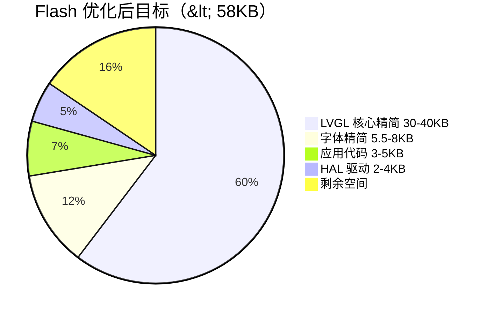
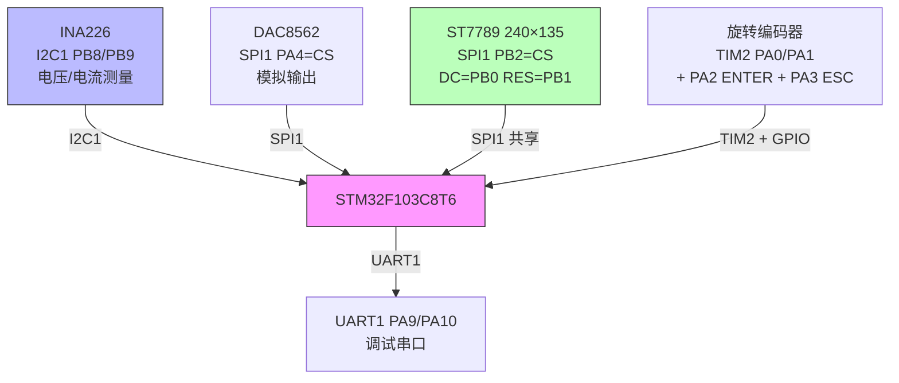

# STM32F103C8T6 优化指南

## 1. 芯片资源

| 资源 | 容量 | 可用（扣除栈/向量表） |
|------|------|----------------------|
| Flash | 64 KB | ~58 KB |
| SRAM | 20 KB | ~16 KB |
| FPU | 无 | 软件浮点（慢 10-50x） |
| DMA2D | 无 | 纯软件渲染 |

**结论：当前配置完全不可用。** 仅 `LV_MEM_SIZE`（1MB）就是 SRAM 的 50 倍，字体数据（150-300KB）是 Flash 的 2-5 倍。必须全面优化。

### 1.1 Flash 占用对比



---

## 2. Flash 预算

### 2.1 当前估算（未优化）

| 组件 | Flash 占用 |
|------|-----------|
| LVGL 核心（全部功能） | 150-200 KB |
| 字体（18 个 Montserrat 尺寸 + 其他） | 150-300 KB |
| 示例和演示 | 150-700 KB |
| Lottie/ThorVG/图像解码器 | 80-250 KB |
| 应用代码（MVC 模块 + 模拟） | 3-5 KB |
| **总计** | **530-1450 KB** |

### 2.2 优化后目标

| 组件 | Flash 占用 | 说明 |
|------|-----------|------|
| LVGL 核心（精简） | 30-40 KB | 仅启用使用的控件和功能 |
| Montserrat 12 精简 | 1.5-2 KB | 仅 59 个字符 |
| Montserrat 28 精简 | 4-6 KB | 仅 59 个字符 |
| 应用代码 | 3-5 KB | MVC 模块（bms_ui.cpp + bms_sim.c + view + controller） |
| HAL 驱动 | 2-4 KB | SPI 显示 + GPIO 输入 |
| **总计** | **41-57 KB** | 目标 < 58 KB ✓ |

精简字符集后 Flash 预算充裕，Montserrat 28 不再是风险点。

---

## 3. SRAM 预算

### 3.1 显示缓冲区

| 方案 | 缓冲区大小 | 说明 |
|------|-----------|------|
| 全帧缓冲（不可行） | 64,800 B | 240×135×2 字节，超过 SRAM |
| 20 行部分缓冲 | 9,600 B | 240×20×2，刷新流畅 |
| 10 行部分缓冲 | 4,800 B | 240×10×2，推荐 |
| 单行缓冲 | 480 B | 最省内存，但刷新慢 |

**推荐：10 行部分缓冲（4,800 字节）。** 刷新 135 行需要 14 次 flush，每次传输 4,800 字节。SPI@18MHz 传输 4,800 字节约 2.1ms，总刷新时间约 30ms（33 FPS），可接受。

### 3.2 LVGL 内存池

```c
#define LV_MEM_SIZE (8 * 1024)  // 8 KB
```

88 个 LVGL 对象 × ~50 字节 ≈ 4.4 KB，加上内部开销约 6-8 KB。8 KB 足够。

### 3.3 总 SRAM 预算

| 组件 | SRAM 占用 |
|------|----------|
| 显示缓冲区（10 行） | 4,800 B |
| LVGL 内存池 | 8,192 B |
| 应用变量（模拟状态等） | 512 B |
| 栈 | 1,024 B |
| 向量表 + 系统 | 512 B |
| **总计** | **~15 KB** / 20 KB |

剩余约 5 KB 余量，可接受。

---

## 4. lv_conf.h 完整优化配置

### 4.1 色深（必须修改）

```c
// 行 29：32-bit → 16-bit
#define LV_COLOR_DEPTH  16
```

### 4.2 内存池（必须修改）

```c
// 行 71：1MB → 8KB
#define LV_MEM_SIZE  (8 * 1024)
```

### 4.3 字体（精简字符集）

通过分析 MVC 模块所有字符串字面量，Montserrat 12 实际使用 **64 个字符**：

```
A B C D E F G H I J K L M N O P Q R S T U V W X Y Z
a b d e f g h i l m n o p r s t u y
0 1 2 3 4 5 6 7 8 9
! % * + - . : < > [ ] 空格
```

Montserrat 28 仅用于 SoC 百分比显示（`%d%%`），只需 **11 个字符**：`0 1 2 3 4 5 6 7 8 9 %`

> **注意：** 原 59 字符子集缺少 `e` 和 `g`（"ESTABLISHED"、"CHARGING" 等字符串需要），且包含未使用的 `"`、`'`、`_`。以下 range 已修正。

使用 LVGL 官方字体工具（https://lvgl.io/tools/fontconverter）生成精简字体：

| 字体 | 完整版 Flash | 精简版 Flash | 节省 |
|------|-------------|-------------|------|
| Montserrat 12（64 字符） | 5-8 KB | ~1.5-2 KB | 3-6 KB |
| Montserrat 28（11 字符） | 13-22 KB | ~2-3 KB | 10-19 KB |
| ~~Montserrat 14~~ | ~~禁用~~ | — | — |
| **总计** | **18-30 KB** | **3.5-5 KB** | **13-25 KB** |

**生成步骤：**
1. 访问 https://lvgl.io/tools/fontconverter
2. 上传 Montserrat 字体文件（TTF/OTF）
3. 设置 Size=12，Bpp=4
4. 在 Range 字段输入：`0x20-0x21,0x25,0x2A-0x2E,0x30-0x39,0x3A,0x3C-0x3E,0x41-0x5A,0x5B-0x5D,0x61-0x62,0x64-0x67,0x68-0x69,0x6D-0x6F,0x72-0x75`
5. 生成 C 文件，保存为 `fonts/montserrat_12_subset.c`
6. 重复 Size=28，Range 输入：`0x25,0x30-0x39`，生成 `fonts/montserrat_28_subset.c`

```c
// lv_conf.h 配置：禁用所有内置字体
#define LV_FONT_MONTSERRAT_8   0
#define LV_FONT_MONTSERRAT_12  0   // 使用精简子集替代
#define LV_FONT_MONTSERRAT_14  0   // 未使用，所有 widget 显式设为 M12
#define LV_FONT_MONTSERRAT_28  0   // 使用精简子集替代
// ... 所有其他字体设为 0

// 在 lv_conf.h 或独立头文件中声明自定义字体
LV_FONT_DECLARE(montserrat_12_subset);
LV_FONT_DECLARE(montserrat_28_subset);

// 修改 bms_ui_styles.c / bms_ui_pages.c 中的字体引用：
// lv_font_montserrat_12 → montserrat_12_subset
// lv_font_montserrat_28 → montserrat_28_subset
// LV_FONT_DEFAULT → &montserrat_12_subset
```

### 4.4 SDL 驱动（必须禁用）

```c
// 行 1286
#define LV_USE_SDL  0
```

### 4.5 示例和演示（必须禁用）

```c
// 行 1468-1535
#define LV_BUILD_EXAMPLES  0
#define LV_BUILD_DEMOS     0
// 所有 LV_USE_DEMO_* 设为 0
```

### 4.6 大型库（必须禁用）

```c
#define LV_USE_LOTTIE           0   // 行 841：Lottie 动画（30-80 KB）
#define LV_USE_THORVG_INTERNAL  0   // 行 1073：矢量图形（50-150 KB）
#define LV_USE_VECTOR_GRAPHIC   0   // 行 1069
#define LV_USE_TINY_TTF         0   // 行 1051：TTF 解码器
#define LV_USE_LZ4_INTERNAL     0   // 行 1083：压缩库
#define LV_USE_LODEPNG          0   // 行 998：PNG 解码器
#define LV_USE_BMP              0   // 行 1004
#define LV_USE_TJPGD            0   // 行 1008：JPEG 解码器
#define LV_USE_QRCODE           0   // 行 1034
#define LV_USE_BARCODE          0   // 行 1037
#define LV_USE_RLE              0   // 行 1031
```

### 4.7 未使用的控件（必须禁用）

```c
#define LV_USE_ANIMIMG    0   // 行 787
#define LV_USE_ARCLABEL   0   // 行 791
#define LV_USE_CALENDAR   0   // 行 799
#define LV_USE_MENU       0   // 行 843
#define LV_USE_SPAN       0   // 行 853
#define LV_USE_IMGFONT    0   // 行 1217
```

### 4.8 主题（禁用未使用的）

```c
#define LV_USE_THEME_DEFAULT  0   // 行 886：UI 使用自定义样式
#define LV_USE_THEME_SIMPLE   0   // 行 899
#define LV_USE_THEME_MONO     0   // 行 902
```

### 4.9 渲染优化

```c
// 行 208：禁用圆角/阴影/倾斜渲染（UI 已经全部使用直角）
#define LV_DRAW_SW_COMPLEX  0

// 行 230：禁用复杂渐变
#define LV_USE_DRAW_SW_COMPLEX_GRADIENTS  0

// 行 178-188：仅保留 RGB565 格式支持
#define LV_DRAW_SW_SUPPORT_RGB565        1
#define LV_DRAW_SW_SUPPORT_RGB565_SWAPPED 0
#define LV_DRAW_SW_SUPPORT_RGB565A8       1   // 透明度需要
#define LV_DRAW_SW_SUPPORT_RGB888         0
#define LV_DRAW_SW_SUPPORT_XRGB8888       0
#define LV_DRAW_SW_SUPPORT_ARGB8888       0
#define LV_DRAW_SW_SUPPORT_ARGB8888_PREMULTIPLIED 0
#define LV_DRAW_SW_SUPPORT_L8             0
#define LV_DRAW_SW_SUPPORT_AL88           0
#define LV_DRAW_SW_SUPPORT_A8             0
#define LV_DRAW_SW_SUPPORT_I1             0
```

### 4.10 其他节省

```c
#define LV_USE_FLOAT     0   // 行 652：禁用浮点支持（Cortex-M3 无 FPU）
#define LV_USE_MATRIX    0   // 行 656
#define LV_USE_LOG       0   // 行 459
#define LV_USE_ASSERT_NULL            0   // 行 505
#define LV_USE_ASSERT_MALLOC          0   // 行 506
#define LV_USE_ASSERT_STYLE           0   // 行 507
#define LV_USE_ASSERT_MEM_INTEGRITY   0   // 行 508
#define LV_USE_ASSERT_OBJ             0   // 行 509
#define LV_USE_CHECK_ARG              0   // 行 523
#define LV_USE_SYSMON                 0   // 行 1115
#define LV_USE_OBSERVER               0   // 行 1220
#define LV_OBJ_STYLE_CACHE            0   // 行 579
#define LV_USE_OBJ_ID                 0   // 行 582
#define LV_USE_OBJ_NAME               0   // 行 585
#define LV_USE_FS_STDIO               0   // 行 928
#define LV_USE_FONT_PLACEHOLDER       0   // 行 724
#define LV_LABEL_TEXT_SELECTION        0   // 行 830
#define LV_LABEL_LONG_TXT_HINT        0   // 行 831
```

---

## 5. 浮点数消除（已实施）

### 5.1 问题

Cortex-M3 无 FPU，软件浮点运算极慢。原 `bms_ui.c` 使用 12 个 float 变量进行电池模拟，每次 `bms_sim_tick`（200ms）执行多次浮点乘法和除法。

### 5.2 实际方案：领域缩放 int32_t

> **已实施。** 实际采用了比 Q16.16 更优的方案——领域缩放整数（domain-scaled integers）。

`bms_state_t` 中所有字段均为 `int32_t`，按物理含义选择缩放因子：

| 原方案（float） | 实际实现（int32_t） | 缩放说明 |
|----------------|-------------------|---------|
| `float soc` | `int32_t soc_x10` | SoC × 10（85.0% = 850） |
| `float voltage` | `int32_t voltage_mV` | 毫伏（mV） |
| `float current` | `int32_t current_mA` | 毫安（mA），负 = 放电 |
| `float temperature` | `int32_t temperature_x10` | 温度 × 10（25.0°C = 250） |
| `float r_internal` | `int32_t resistance_mOhm` | 毫欧（mΩ） |
| `float charge_u_set` | `int32_t charge_u_set_mV` | 毫伏 |
| `float charge_i_set` | `int32_t charge_i_set_mA` | 毫安 |
| `float discharge_i_set` | `int32_t discharge_i_set_mA` | 毫安 |

**与 Q16.16 的对比：**

| 维度 | Q16.16 定点数 | 领域缩放 int32_t |
|------|-------------|-----------------|
| 显示格式化 | 需要 `fixed_to_str()` 位运算转换 | 直接用 `snprintf` 整数除法 |
| 精度 | 二进制分数，有舍入误差 | 十进制精确（1 mV = 1 mV） |
| 与传感器 API 对齐 | 需要来回转换 | INA226 直接输出 mV/mA，零转换 |
| 代码复杂度 | 需要 `FIXED_MUL`/`FIXED_DIV` 宏 | 普通整数运算 |

### 5.3 显示格式化

`bms_ui_refresh.c` 中使用 `fmt_milli()` 和 `fmt_x10()` 纯整数格式化函数，完全避免浮点运算：

```c
// mV/mA → "x.xx" 格式（如 4120 mV → "4.12"）
static void fmt_milli(char* buf, int32_t val)
{
    int32_t whole = val / 1000;
    int32_t frac = (val < 0 ? -val : val) % 1000 / 10;
    snprintf(buf, 12, "%ld.%02ld", (long)whole, (long)frac);
}

// x10 值 → "x.x" 格式（如 250 → "25.0"）
static void fmt_x10(char* buf, int32_t val)
{
    int32_t whole = val / 10;
    int32_t frac = (val < 0 ? -val : val) % 10;
    snprintf(buf, 8, "%ld.%ld", (long)whole, (long)frac);
}
```

### 5.4 模拟层说明

PC 模拟器 `bms_sim.c` 内部仍使用 float 进行电池物理计算（OCV 多项式、CCCV 充电等），但通过 `sync_to_state()` 函数将 float 结果转换为 `int32_t` 写入 `bms_state_t`。

**在 STM32 上，`bms_sim.c` 会被完全替换为真实硬件驱动**（读取 INA226/DAC8562/NTC），float 代码不会在目标上运行。这正是 MVC 解耦的核心价值——View 和 Controller 不依赖任何 float 代码。

---

## 6. 控件简化

### 6.1 Chart → lv_line 替代 ✅ 已完成 (commit `74717c7`)

`lv_chart` 控件 41.6 KB .o，已用 `lv_line` + `lv_line_set_points_mutable()` + `lv_line_set_y_invert(true)` 替代，实现环形缓冲区折线图。lv_chart.c.o 降至 48 B（空桩）。

### 6.2 Bar → lv_obj 替代 ✅ 已完成 (commit `24ce0d6`)

`lv_bar` 控件 13.6 KB .o，已用嵌套 `lv_obj`（外层轨道 + 内层指示器）+ `lv_obj_set_width()` 动态宽度替代。lv_bar.c.o 降至 48 B（空桩）。

### 6.3 底部渐变条 → 简化

当前 `create_undersampled_bottom_bar` 创建 7 个容器 × 4 个子段 = 35 个额外对象。可以改为：
- 单个 `lv_obj` + 自定义绘制回调
- 或直接用按钮的 border 颜色变化替代

### 6.4 日志终端

`bms_state_t` 中的 `log_lines[4][64]` 占用 256 字节 SRAM。如果不需要完整日志，可以缩减为 2×64 字节或移除。

---

## 7. 构建系统

### 7.1 工具链

```cmake
# cmake/arm-none-eabi-gcc.cmake
set(CMAKE_SYSTEM_NAME Generic)
set(CMAKE_C_COMPILER arm-none-eabi-gcc)
set(CMAKE_C_FLAGS "-mcpu=cortex-m3 -mthumb -Os -ffunction-sections -fdata-sections")
set(CMAKE_EXE_LINKER_FLAGS "-Wl,--gc-sections -specs=nosys.specs -specs=nano.specs")
```

`-Os` 优化大小，`-ffunction-sections -fdata-sections` + `--gc-sections` 移除未使用的代码。

### 7.2 链接脚本

确保链接脚本中的 Flash/SRAM 大小正确：
```
MEMORY {
    FLASH (rx) : ORIGIN = 0x08000000, LENGTH = 64K
    RAM   (rwx): ORIGIN = 0x20000000, LENGTH = 20K
}
```

---

## 8. HAL 驱动配置

### 8.1 SPI 显示（ST7789/ILI9341）

```c
// SPI1 配置：18MHz 时钟（72MHz / 4）
hspi1.Instance = SPI1;
hspi1.Init.Mode = SPI_MODE_MASTER;
hspi1.Init.BaudRatePrescaler = SPI_BAUDRATEPRESCALER_4;
hspi1.Init.DataSize = SPI_DATASIZE_8BIT;
hspi1.Init.CLKPol = SPI_POLARITY_LOW;
hspi1.Init.CLKPhase = SPI_PHASE_1EDGE;

// DMA 传输（可选，减少 CPU 占用）
// SPI TX DMA → DMA1 Channel 3
```

### 8.2 GPIO 输入（3 个按键替代编码器）

```c
// PA0: LEFT  (上一页)
// PA1: RIGHT (下一页)
// PA2: ENTER (确认/进入编辑)
// PA3: ESC   (返回/退出编辑)

static void read_cb(lv_indev_t *indev, lv_indev_data_t *data)
{
    static uint32_t last_key = 0;
    uint32_t key = 0;

    if(HAL_GPIO_ReadPin(GPIOA, GPIO_PIN_0) == GPIO_PIN_RESET) key = LV_KEY_LEFT;
    else if(HAL_GPIO_ReadPin(GPIOA, GPIO_PIN_1) == GPIO_PIN_RESET) key = LV_KEY_RIGHT;
    else if(HAL_GPIO_ReadPin(GPIOA, GPIO_PIN_2) == GPIO_PIN_RESET) key = LV_KEY_ENTER;
    else if(HAL_GPIO_ReadPin(GPIOA, GPIO_PIN_3) == GPIO_PIN_RESET) key = LV_KEY_ESC;

    data->key = key;
    data->state = (key != 0) ? LV_INDEV_STATE_PRESSED : LV_INDEV_STATE_RELEASED;
}
```

---

## 9. 可行性结论

| 指标 | 目标 | 优化后估算 | 结论 |
|------|------|-----------|------|
| Flash | < 58 KB | 41-57 KB | **可行**（精简字体后） |
| SRAM | < 16 KB | ~15 KB | **可行**，有 5KB 余量 |
| 刷新率 | > 20 FPS | ~33 FPS | **可行** |
| 按键响应 | < 100ms | ~5ms | **可行** |

**最终建议：**
- 使用精简字符集字体（仅 59 个字符），节省 12-22KB Flash，预算从「边缘可行」变为「可行」
- 如果 Flash 仍超 64KB，移除 USB PCD 驱动（节省 2-4KB）或 `lv_chart`（节省 5-10KB）
- SRAM 充足（~15KB / 20KB），无需进一步优化

---

## 9.5 LVGL 进一步精简可行性

### 9.5.1 最小可用 LVGL 配置

MVC 模块实际仅使用 **6 种控件**和 **2 种混合格式**：

| 类别 | 保留 | 禁用 |
|------|------|------|
| 控件 | obj, label, button, line | 其余 24+ 种（bar/chart 已移除） |
| 混合格式 | RGB565, A8（字体抗锯齿） | RGB565_SWAPPED, RGB888, XRGB8888, ARGB8888, L8, AL88, I1 |
| 布局 | 无（全部 `lv_obj_set_pos` 绝对定位） | flex, grid |
| 主题 | 无（全部自定义 style） | default, simple, mono |
| 图像 | 无 | lodepng, tjpgd, bmp, rle, qrcode, barcode |
| 动画 | 无 | anim, animimg, lottie |
| 矢量 | 无 | thorvg, vector_graphic |

### 9.5.2 最小配置 Flash 预算

| 组件 | 源码大小 | 编译后 Flash | 说明 |
|------|---------|-------------|------|
| LVGL 核心 | ~200 KB | 15-20 KB | obj, event, style, group, timer, display, indev |
| 4 个控件 | ~80 KB | 5-8 KB | label(30K), button(15K), line(5K)（bar/chart 已移除） |
| `blend_to_rgb565.c` | 69 KB | 20-25 KB | **最大单项**，含 5 种混合模式（NORMAL/ADD/SUB/MUL/DIFF） |
| `blend_to_a8.c` | 22 KB | 8-10 KB | 字体抗锯齿 alpha 混合 |
| 核心绘制（line, rect, triangle, arc, text） | ~100 KB | 12-18 KB | 基础图元绘制 |
| 精简字体 ×3 | ~15 KB | 5.5-8 KB | Montserrat 12/14/28 精简字符集 |
| **总计** | | **68.5-93 KB** | |

### 9.5.3 结论：LVGL 核心本身就是瓶颈

**LVGL 核心 + RGB565 渲染引擎 ≈ 48-67KB**，加上字体和应用代码后接近或超过 64KB。

进一步精简的可能方向：

| 方案 | 节省 | 可行性 | 风险 |
|------|------|--------|------|
| ~~移除 `lv_chart`，改用自定义折线绘制~~ | ~~5-10 KB~~ | ✅ 已完成 | commit `74717c7` |
| ~~移除 `lv_bar`，改用 `lv_obj` + 手动设置宽度~~ | ~~3-5 KB~~ | ✅ 已完成 | commit `24ce0d6` |
| ~~修改 `blend_to_rgb565.c`，移除非 NORMAL 混合模式~~ | ~~5-8 KB~~ | ✅ 已完成 | commit `224f280` |
| 使用 1bpp 字体（无抗锯齿）替代 4bpp | 2-3 KB | 高 | 文字边缘锯齿明显 |
| 移除 `LV_DRAW_SW_SUPPORT_A8` | 8-10 KB | 中 | 字体抗锯齿失效，但节省显著 |
| 使用 LVGL v9 的 `LV_USE_VECTOR_GRAPHIC` 替代 SW 绘制 | 0 | 不适用 | F103 无 GPU |
| 自己写最小 UI 库替代 LVGL | 40-50 KB | 低 | 工作量巨大，失去 LVGL 生态 |

### 9.5.4 推荐策略

**Phase 1+2+3 已全部完成（commits `29cb6e3` → `e4a3bf1` → `24ce0d6`/`746a639`/`224f280`/`74717c7`）：**
1. ✅ 移除 `lv_chart` + `lv_bar`（节省 ~55 KB .o），用 lv_line / lv_obj 替代
2. ✅ 修改 `blend_to_rgb565.c` 移除非 NORMAL 混合模式（blend 从 ~12 KB 降至 2.9 KB）
3. ✅ 守卫 blur dispatch（`#if LV_DRAW_SW_COMPLEX`）
4. A8 blend 已保留（`LV_DRAW_SW_SUPPORT_A8 = 1`，字体抗锯齿必需）

**如果 64KB 刚好够：**
- 当前方案（精简字体 + 禁用未用控件/库）即可，无需进一步精简

**如果需要更小的目标（如 STM32F103C6T6，32KB Flash）：**
- 必须放弃 LVGL，使用自定义最小 UI 库

---

## 10. BMS-Core 项目集成方案

### 10.1 现有硬件资源

BMS-Core 项目已具备完整的硬件驱动，无需从头编写：



| 驱动 | 文件 | 接口 | 状态 | 用途 |
|------|------|------|------|------|
| INA226 | `BSP/Src/ina226.cpp` | I2C1 (PB8/PB9) | 已集成 | 电压/电流/功率测量 |
| DAC8562 | `BSP/Src/dac8562.cpp` | SPI1 (PA5/PA6/PA7), CS=PA4 | 已集成 | 模拟输出 |
| ST7789 | `BSP/Src/st7789.cpp` | SPI1 共享, DC/RES/CS/BLK 待分配 | 已实现未实例化 | 240×135 LCD |
| TIM2 | `Core/Src/tim.c` | PA0/PA1 | 已配置未使用 | 旋转编码器 |

### 10.2 外设引脚分配

```
已占用:
  I2C1:  PB8 (SCL), PB9 (SDA)     → INA226
  I2C2:  PB10 (SCL), PB11 (SDA)   → 空闲（可用于扩展）
  SPI1:  PA5 (SCK), PA6 (MISO), PA7 (MOSI) → DAC8562 + ST7789 共享
  DAC CS: PA4 (软件控制)
  TIM2:  PA0 (CH1), PA1 (CH2)     → 旋转编码器
  UART1: PA9 (TX), PA10 (RX)      → 调试串口
  USB:   PA11 (DM), PA12 (DP)     → 未使用
  LED:   PC13
  SWD:   PA13, PA14

待分配（ST7789 LCD 引脚）:
  DC:    建议 PB0
  RES:   建议 PB1
  CS:    建议 PB2
  BLK:   建议 PB3（PWM 背光调节）或直接 VCC
```

### 10.3 SPI1 共享互斥

DAC8562 和 ST7789 共享 SPI1，通过各自的 CS 引脚互斥访问：

```
DAC8562: PA4 = CS（低有效）
ST7789:  PB2 = CS（低有效，待分配）

规则：同一时刻只有一个设备的 CS 为低
  - DAC8562 操作前: HAL_GPIO_WritePin(GPIOA, GPIO_PIN_4, GPIO_PIN_RESET)
  - DAC8562 操作后: HAL_GPIO_WritePin(GPIOA, GPIO_PIN_4, GPIO_PIN_SET)
  - ST7789 flush 前: HAL_GPIO_WritePin(GPIOB, GPIO_PIN_2, GPIO_PIN_RESET)
  - ST7789 flush 后: HAL_GPIO_WritePin(GPIOB, GPIO_PIN_2, GPIO_PIN_SET)
```

ST7789 驱动已内置 CS 控制（通过 `Pins` 结构体），无需额外处理。

### 10.4 LVGL 集成步骤

#### 第一步：添加 LVGL 库

```bash
cd BMS-Core/Middlewares
git submodule add https://github.com/lvgl/lvgl.git
git checkout v9.1  # 或最新稳定版
```

在 `CMakeLists.txt` 中添加：
```cmake
add_subdirectory(Middlewares/lvgl)
target_link_libraries(${PROJECT_NAME} lvgl)
```

#### 第二步：创建 lv_conf.h

从 `lv_conf_template.h` 复制，应用第 4 节的全部优化配置。

#### 第三步：ST7789 → LVGL 显示驱动桥接

```c
// App/Src/lv_port_disp.cpp
#include "lvgl.h"
#include "st7789.hpp"

static lv_display_t *disp;
static St7789::Pins lcd_pins = {
    .cs_port = GPIOB, .cs_pin = GPIO_PIN_2,
    .dc_port = GPIOB, .dc_pin = GPIO_PIN_0,
    .res_port = GPIOB, .res_pin = GPIO_PIN_1,
    .blk_port = GPIOB, .blk_pin = GPIO_PIN_3,
};
static St7789 lcd(&hspi1, lcd_pins);

// 10 行部分缓冲（4,800 字节）
#define BUF_LINES  10
static uint16_t buf1[240 * BUF_LINES];

static void flush_cb(lv_display_t *disp, const lv_area_t *area, uint8_t *px_map)
{
    lcd.flush_cb(area->x1, area->y1, area->x2, area->y2, (uint16_t *)px_map);
    lv_display_flush_ready(disp);
}

void lv_port_disp_init(void)
{
    lcd.init(St7789::LANDSCAPE);
    disp = lv_display_create(240, 135);
    lv_display_set_flush_cb(disp, flush_cb);
    lv_display_set_buffers(disp, buf1, NULL, sizeof(buf1), LV_DISPLAY_RENDER_MODE_PARTIAL);
}
```

#### 第四步：TIM2 编码器 → LVGL 输入设备

```c
// App/Src/lv_port_indev.cpp
#include "lvgl.h"
#include "tim.h"

static lv_indev_t *indev_enc;

static void read_cb(lv_indev_t *indev, lv_indev_data_t *data)
{
    static int32_t last_count = 0;
    int32_t count = (int32_t)__HAL_TIM_GET_COUNTER(&htim2);
    int32_t diff = (count - last_count) / 4;  // 编码器 4 倍频
    last_count = count;

    data->enc_diff = diff;

    // 编码器按下 → ENTER，可额外接一个 GPIO 按键做 ESC
    // PA2 = ENTER（编码器按键），PA3 = ESC（独立按键）
    if(HAL_GPIO_ReadPin(GPIOA, GPIO_PIN_2) == GPIO_PIN_RESET)
        data->key = LV_KEY_ENTER;
    else if(HAL_GPIO_ReadPin(GPIOA, GPIO_PIN_3) == GPIO_PIN_RESET)
        data->key = LV_KEY_ESC;
    else
        data->key = 0;

    data->state = (data->key != 0) ? LV_INDEV_STATE_PRESSED : LV_INDEV_STATE_RELEASED;
}

void lv_port_indev_init(void)
{
    HAL_TIM_Encoder_Start(&htim2, TIM_CHANNEL_ALL);

    indev_enc = lv_indev_create();
    lv_indev_set_type(indev_enc, LV_INDEV_TYPE_ENCODER);
    lv_indev_set_read_cb(indev_enc, read_cb);
    lv_indev_set_group(indev_enc, lv_group_get_default());
}
```

#### 第五步：SysTick 添加 lv_tick_inc

```c
// Core/Src/stm32f1xx_it.c → SysTick_Handler
void SysTick_Handler(void)
{
    HAL_IncTick();
    lv_tick_inc(1);  // 添加此行
}
```

#### 第六步：主循环集成

```c
// App/Src/app.cpp
#include "lvgl.h"
#include "lv_port_disp.h"
#include "lv_port_indev.h"
#include "bms_ui.h"
#include "ina226.hpp"

extern I2C_HandleTypeDef hi2c1;
static Ina226 sensor(&hi2c1);

void app_init(void)
{
    lv_init();
    lv_port_disp_init();
    lv_port_indev_init();
    bms_ui_init();

    sensor.init(2000, 15000);  // 2mOhm, 15A max
}

void app_run(void)
{
    // 读取真实硬件数据
    int32_t voltage_mV = sensor.getBusVoltage_mV();
    int32_t current_mA = sensor.getCurrent_mA();

    // 方案：用 bms_hw.c 替换 bms_sim.c，实现 bms_sim.h 同一套 API
    // bms_sim_set_voltage_mV(voltage_mV);  // 或直接在 bms_hw_tick_200ms() 中读取传感器
    // bms_sim_set_current_mA(current_mA);

    lv_timer_handler();
    HAL_Delay(5);  // 约 200Hz LVGL 刷新
}
```

### 10.5 模拟变量 → 真实硬件映射

| bms_state_t 字段 | 类型 | PC 模拟来源 | STM32 替换为 |
|------------------|------|-----------|-------------|
| `soc_x10` | int32_t | 计算值（SoC × 10） | INA226 电压查表或库仑计 |
| `voltage_mV` | int32_t | 模拟值（mV） | `sensor.getBusVoltage_mV()` |
| `current_mA` | int32_t | 模拟值（mA） | `sensor.getCurrent_mA()` |
| `temperature_x10` | int32_t | 模拟值（°C × 10） | NTC 热敏电阻 ADC 读数（需添加 ADC） |
| `resistance_mOhm` | int32_t | 固定值（mΩ） | ΔV/ΔI 实时计算 |
| `charge_active` | bool | 模拟 toggle | DAC8562 输出使能 |
| `discharge_active` | bool | 模拟 toggle | DAC8562 输出使能 |
| `charge_u_set_mV` | int32_t | 用户设置（mV） | DAC8562 通道 A 输出电压 |
| `charge_i_set_mA` | int32_t | 用户设置（mA） | DAC8562 通道 B 输出电流限制 |
| `baud_rate_idx` | int | 模拟设置 | USART1 实际配置 |
| `port_idx` | int | 模拟设置 | 实际端口选择 |

> **注：** OCV（开路电压）是 `bms_sim.c` 内部变量，不暴露在 `bms_state_t` 中。STM32 上可用 INA226 开路电压测量替代。

### 10.6 需要解决的问题

#### 10.6.1 main.c / main.cpp 冲突
`Core/Src/main.cpp`（旧版内联代码）和 `Core/Src/main.c`（新版 app 架构）都定义了 `main()`。CMakeLists.txt 当前编译 `main.cpp`。需要：
- 删除或重命名 `main.cpp`
- 确保 `main.c` 被编译
- 或将 `main.c` 的逻辑合并到 `main.cpp`

#### 10.6.2 ST7789 引脚配置
ST7789 的 DC/RES/CS/BLK 引脚未在 CubeMX 中配置为 GPIO 输出。需要：
- 在 `.ioc` 文件中添加 PB0-PB3 为 GPIO_Output
- 或在代码中手动初始化

#### 10.6.3 INA226 → MVC 数据桥接（已解决）

> **已解决。** MVC 解耦后，`bms_state_t` 定义在 `bms_state.h` 中（公开），`bms_sim_get_state()` 返回 const 指针，`bms_data_bridge_t` 提供函数指针注入。STM32 移植时只需用 `bms_hw.c` 替换 `bms_sim.c`，实现同一套 `bms_sim.h` API 即可。

#### 10.6.4 C++ → C 混编（已解决）

> **已解决。** `bms_ui.h` 已有 `#ifdef __cplusplus extern "C" { #endif` 保护，`bms_ui.cpp` 作为 C++ 组合根通过 `extern "C"` 链接 C 模块。LVGL 和所有 MVC 模块均为纯 C。

### 10.7 Flash 预算（BMS-Core 实际）

| 组件 | Flash 占用 |
|------|-----------|
| STM32 HAL 库（已启用模块） | 8-12 KB |
| INA226 驱动 (C++) | 1-2 KB |
| DAC8562 驱动 (C++) | 1-2 KB |
| ST7789 驱动 (C++) | 1-2 KB |
| LVGL 核心（精简） | 30-40 KB |
| Montserrat 12 + 28 精简 | 5.5-8 KB |
| MVC 应用模块（bms_ui.cpp + view + controller + bms_sim.h 接口） | 3-5 KB |
| LVGL 集成胶水代码 | 1-2 KB |
| **总计** | **50.5-67 KB** |

**64KB Flash 紧张但可行。** 确保：
1. `-Os` + `--gc-sections` 移除所有未引用代码
2. 使用精简字符集字体（节省 12-22KB）
3. 考虑移除 USB PCD 驱动（节省 2-4KB）

### 10.8 SRAM 预算（BMS-Core 实际）

| 组件 | SRAM 占用 |
|------|----------|
| LVGL 显示缓冲区（10 行） | 4,800 B |
| LVGL 内存池 | 8,192 B |
| INA226 驱动实例 | 64 B |
| DAC8562 驱动实例 | 32 B |
| ST7789 驱动实例 | 32 B |
| BMS 应用变量 | 256 B |
| 栈 | 1,024 B |
| 向量表 + 系统 | 512 B |
| **总计** | **~15 KB** / 20 KB |

SRAM 余量约 5KB，足够。

---

## 11. LVGL Flash 完整分析（实测数据）

基于当前 PC 模拟器配置（全功能开启）的编译产物，`size` 工具实测 `.o` 文件 text 段大小。

### 11.1 当前总览（未优化）

| 组件 | 编译后大小 | 说明 |
|------|-----------|------|
| libs（lz4/lodepng/thorvg/tiny_ttf/qrcode 等） | **1,341.7 KB** | 全部不需要 |
| font（18 个 Montserrat + CJK + 其他） | **1,169.6 KB** | 仅需 3 个 |
| stdlib（标准库封装） | **1,056.6 KB** | 部分需要 |
| widgets（28 种控件） | **428.8 KB** | 仅需 6 种 |
| draw（渲染引擎 + 10 种混合格式） | **309.1 KB** | 仅需 2 种格式 |
| core（obj/event/style/group/timer） | **180.2 KB** | 全部需要 |
| misc（样式/动画/事件/文本/缓存） | **147.4 KB** | 部分需要 |
| themes（3 种主题） | **44.5 KB** | 不需要 |
| indev（输入设备） | **28.9 KB** | 需要 |
| layouts（flex + grid） | **24.2 KB** | 不需要 |
| display（显示驱动框架） | **22.3 KB** | 需要 |
| drivers（SDL 等） | **15.0 KB** | 不需要 |
| **总计** | **4,775.1 KB** | 目标 < 58 KB |

### 11.2 字体逐项分析

| 字体文件 | 大小 | 需要？ | 说明 |
|---------|------|--------|------|
| `lv_font_source_han_sans_sc_16_cjk.c` | 191.2 KB | 否 | 中文字体 |
| `lv_font_montserrat_48.c` | 94.6 KB | 否 | |
| `lv_font_montserrat_46.c` | 89.1 KB | 否 | |
| `lv_font_montserrat_44.c` | 81.6 KB | 否 | |
| `lv_font_montserrat_42.c` | 75.3 KB | 否 | |
| `lv_font_montserrat_40.c` | 68.7 KB | 否 | |
| `lv_font_montserrat_38.c` | 62.0 KB | 否 | |
| `lv_font_montserrat_36.c` | 56.2 KB | 否 | |
| `lv_font_montserrat_34.c` | 51.2 KB | 否 | |
| `lv_font_montserrat_32.c` | 45.0 KB | 否 | |
| `lv_font_montserrat_30.c` | 41.1 KB | 否 | |
| `lv_font_dejavu_16_persian_hebrew.c` | 39.9 KB | 否 | 波斯语/希伯来语 |
| `lv_font_montserrat_28.c` | 36.6 KB | **是** | SoC 大字显示 |
| `lv_font_montserrat_26.c` | 32.1 KB | 否 | |
| `lv_font_montserrat_14_aligned.c` | 29.3 KB | 否 | 对齐版，冗余 |
| `lv_font_montserrat_24.c` | 28.2 KB | 否 | |
| `lv_font_montserrat_22.c` | 24.8 KB | 否 | |
| `lv_font_montserrat_28_compressed.c` | 21.9 KB | 否 | 压缩版，冗余 |
| `lv_font_montserrat_20.c` | 21.4 KB | 否 | |
| `lv_font_montserrat_18.c` | 18.6 KB | 否 | |
| `lv_font_montserrat_16.c` | 15.7 KB | 否 | |
| `lv_font_montserrat_14.c` | 13.5 KB | **是** | 默认字体 |
| `lv_font_montserrat_12.c` | 11.4 KB | **是** | 主要 UI 字体 |
| `binfont_loader` | 7.8 KB | 否 | 二进制字体加载器 |
| `lv_font_fmt_txt` | 5.1 KB | 是 | 字体格式化引擎 |
| **字体总计** | **1,169.6 KB** | **66.6 KB** | 精简后约 **15-20 KB**（精简字符集） |

### 11.3 控件逐项分析

| 控件 | 大小 | 需要？ |
|------|------|--------|
| `lv_chart.c` | 41.6 KB | **已移除**（用 lv_line 替代，48 B） |
| `lv_scale.c` | 32.2 KB | 否 |
| `lv_textarea.c` | 29.4 KB | 否 |
| `lv_span.c` | 23.6 KB | 否 |
| `lv_dropdown.c` | 23.3 KB | 否 |
| `lv_arc.c` | 23.0 KB | 否 |
| `lv_label.c` | 22.5 KB | **是** |
| `lv_image.c` | 22.2 KB | 否 |
| `lv_table.c` | 20.6 KB | 否 |
| `lv_buttonmatrix.c` | 18.3 KB | 否 |
| `lv_arclabel.c` | 17.1 KB | 否 |
| `lv_menu.c` | 16.5 KB | 否 |
| `lv_roller.c` | 14.2 KB | 否 |
| `lv_bar.c` | 13.6 KB | **已移除**（用 lv_obj 替代，48 B） |
| `lv_spinbox.c` | 13.2 KB | 否 |
| `lv_calendar.c` + header | 12.1 KB | 否 |
| `lv_slider.c` | 8.9 KB | 否 |
| `lv_canvas.c` | 8.5 KB | 否 |
| `lv_imagebutton.c` | 7.5 KB | 否 |
| `lv_tabview.c` | 7.1 KB | 否 |
| `lv_animimage.c` | 6.7 KB | 否 |
| `lv_keyboard.c` | 7.8 KB | 否 |
| `lv_line.c` | 5.6 KB | **是** |
| `lv_msgbox.c` | 5.7 KB | 否 |
| `lv_switch.c` | 4.7 KB | 否 |
| `lv_led.c` | 4.1 KB | 否 |
| `lv_checkbox.c` | 4.0 KB | 否 |
| `lv_lottie.c` | 3.5 KB | 否 |
| `lv_spinner.c` | 3.2 KB | 否 |
| `lv_button.c` | ~2 KB | **是** |
| `lv_obj.c`（容器） | ~0 KB | **是**（核心） |
| **控件总计** | **428.8 KB** | **~83 KB** |

### 11.4 渲染引擎逐项分析

| 文件 | 大小 | 需要？ | 说明 |
|------|------|--------|------|
| `blend_to_rgb565.c` | 23.4 KB | **是** | 目标显示格式 |
| `blend_to_rgb565_swapped.c` | 24.2 KB | 否 | |
| `blend_to_argb8888.c` | 16.0 KB | 否 | |
| `blend_to_rgb888.c` | 13.4 KB | 否 | |
| `blend_to_i1.c` | 14.2 KB | 否 | |
| `blend_to_l8.c` | 10.9 KB | 否 | |
| `blend_to_al88.c` | 10.6 KB | 否 | |
| `blend_to_argb8888_premultiplied.c` | 9.7 KB | 否 | |
| `blend_to_a8.c` | ~8 KB | **是** | 字体抗锯齿 |
| `lv_draw_vector.c` | 16.6 KB | 否 | 矢量图形 |
| `lv_draw_sw_vector.c` | 7.3 KB | 否 | |
| `lv_draw_sw_mask.c` | 14.4 KB | 是 | 圆角/遮罩 |
| `lv_draw_sw_img.c` | 13.8 KB | 否 | 无图像 |
| `lv_draw_sw_transform.c` | 13.2 KB | 否 | 无变换 |
| `lv_draw_sw_box_shadow.c` | 9.8 KB | 否 | 无阴影 |
| `lv_draw_sw_blur.c` | 6.9 KB | 否 | 无模糊 |
| `lv_draw_sw_grad.c` | 6.5 KB | 否 | 无渐变 |
| `lv_draw_label.c` | 8.7 KB | **是** | 文字渲染 |
| `lv_draw_rect.c` | 6.7 KB | **是** | 矩形渲染 |
| `lv_draw_line.c` | ~5 KB | **是** | 线条渲染 |
| `lv_draw_buf.c` | 9.9 KB | 是 | 缓冲区管理 |
| `lv_draw.c` | 6.9 KB | 是 | 绘制调度 |
| **渲染总计** | **309.1 KB** | **~85 KB** |

### 11.5 库逐项分析

| 库 | 大小 | 需要？ |
|----|------|--------|
| lz4（压缩） | 302.3 KB | 否 |
| lodepng（PNG 解码） | 116.1 KB | 否 |
| thorvg（矢量图形 + Lottie） | ~700 KB | 否 |
| tiny_ttf（TTF 解码） | 79.8 KB | 否 |
| qrcode（二维码） | 18.3 KB | 否 |
| bin_decoder（二进制图像） | 13.6 KB | 否 |
| barcode（条形码） | ~8 KB | 否 |
| rle（压缩） | ~3 KB | 否 |
| **库总计** | **1,341.7 KB** | **0 KB** |

### 11.6 最小配置 Flash 预算

仅保留 MVC 模块实际使用的功能：

| 组件 | 保留内容 | 估算大小 |
|------|---------|---------|
| core | obj, event, style, group, timer, refr, tree, pos, scroll, draw, class | 143 KB → ~50 KB |
| misc | style, event, text, area, anim, cache, color, timer, ll, math, utils | 147 KB → ~30 KB |
| widgets | obj, label, button, line | ~50 KB → ~20 KB（bar/chart 已移除） |
| draw | rect, label, line, buf, rgb565 blend, a8 blend, mask | ~85 KB → ~45 KB |
| display | display framework | 22 KB → ~15 KB |
| indev | input device framework | 29 KB → ~20 KB |
| tick | tick source | 0.7 KB → ~0.5 KB |
| fonts | montserrat 12/14/28 精简字符集 | 66 KB → ~15 KB |
| **总计** | | **~210 KB** → **~210 KB** |

**注意：** `.o` 文件大小包含未优化的机器码（未开启 `-Os`，未 strip）。ARM Cortex-M3 `-Os` + `--gc-sections` 后，实际 Flash 占用约为 `.o` text 段的 **40-60%**。

### 11.7 最终估算

| 阶段 | .o 文件大小 | -Os + gc-sections 后 | 说明 |
|------|-----------|---------------------|------|
| 最小 LVGL（控件+渲染+核心） | ~210 KB | **84-126 KB** | 仍超 64KB |
| 其中：blend_to_rgb565 | 23.4 KB | 10-14 KB | 最大单项 |
| 其中：blend_to_a8 | 8 KB | 3-5 KB | 字体抗锯齿 |
| ~~其中：chart 控件~~ | ~~41.6 KB~~ | ~~17-25 KB~~ | ✅ 已移除（48 B） |
| 其中：label 控件 | 22.5 KB | 9-14 KB | 必需 |
| 精简字体 ×3 | 15 KB | 15 KB | 数据段，不压缩 |
| STM32 HAL + 驱动 | ~20 KB | ~15 KB | INA226/DAC/ST7789 |
| MVC 应用模块 | ~5 KB | ~3 KB | bms_ui.cpp + view + controller |
| **总计** | | **117-159 KB** | **超出 64KB 约 53-95 KB** |

### 11.8 结论

**即使用最小 LVGL 配置 + 精简字体 + `-Os` + `--gc-sections`，Flash 仍然超出 64KB 约 50-95KB。**

Phase 3 后实测瓶颈：
1. **LVGL 核心**（obj+style+event+group+refr ≈ 143KB .o）— 不可避免
2. **blend_to_rgb565.c**（2.9 KB .o）— ✅ 已精简
3. ~~**chart 控件**~~（41.6KB → 48B）— ✅ 已移除

**可行的进一步精简方案：**

| 方案 | .o 节省 | -Os 后节省 | 状态 |
|------|---------|-----------|------|
| ~~移除 chart，自定义折线绘制~~ | ~~41.6 KB~~ | ~~17-25 KB~~ | ✅ `74717c7` |
| ~~移除 bar，用 obj+宽度模拟~~ | ~~13.6 KB~~ | ~~5-8 KB~~ | ✅ `24ce0d6` |
| ~~修改 blend_to_rgb565 移除非 NORMAL 模式~~ | ~~~10 KB~~ | ~~4-6 KB~~ | ✅ `224f280` |
| ~~守卫 blur dispatch~~ | ~~7.0 KB~~ | ~~3-5 KB~~ | ✅ `746a639` |
| 禁用 A8 blend（接受无抗锯齿） | 8 KB | 3-5 KB | 未应用（保留抗锯齿） |
| **Phase 3 实际节省** | **~32 KB** | **~13-20 KB** | |

Phase 1+2+3 后实测：LVGL .o = 480.6 KB，App .o = 37.7 KB，总计 518.3 KB。

**如果 64KB 确实不够：**
- 使用 STM32F103**CB**T6（128KB Flash），预算充裕
- 或放弃 LVGL，使用自定义最小 UI 库（预估 20-30KB）
